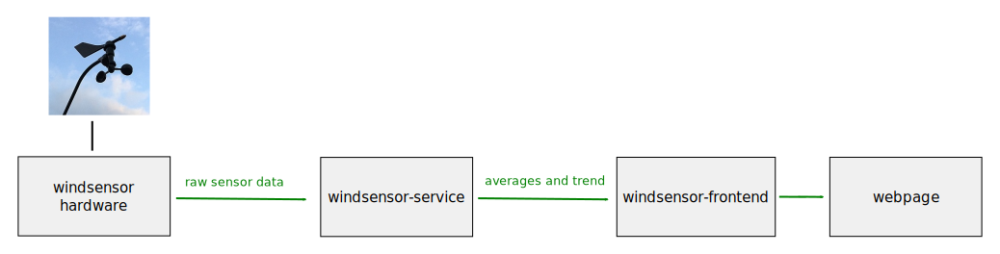

# windsensor-frontend

This prototype of a frontend is part of the following design.

It polls the wind averages from the [windsensor-service](https://github.com/tederer/windsensor-service) and publishes them in a human readable style on a webpage.

Please note that this service is a prototype (without tests) and will change in future.

## building the Docker image

To build the Docker image execute `buildDockerImage.sh`.

## starting the service (using docker)

For a successful execution of the service you need to set the environment variable `SENSOR_URL`. The following command starts the web server on port 80.

    sudo docker run -it --rm --env SENSOR_URL=https://mywindsensor.azurewebsites.net/windsensor/34567 -p 80:80 tederer/windsensor-frontend

The table below describes all supported environment variables.

|variable        |mandatory|type   |description|
|----------------|---------|-------|-----------|
|SENSOR_URL      |yes      |string|The URL of the [windsensor-service](https://github.com/tederer/windsensor-service) that provides the wind average values.|
|WEBSERVER_PORT  |no       |integer|The port the webserver shall use (default=80).|
|LOG_LEVEL       |no       |string |one of [DEBUG, INFO, WARNING, ERROR, OFF]|

## polling container informations

To get the version and the start time of the container, insert the IP address and the port of your container into the following URL and open it in a browser.

    https://<ip-address-of-container>:<port-of-container>/info

## references
[windsensor-service](https://github.com/tederer/windsensor-service)